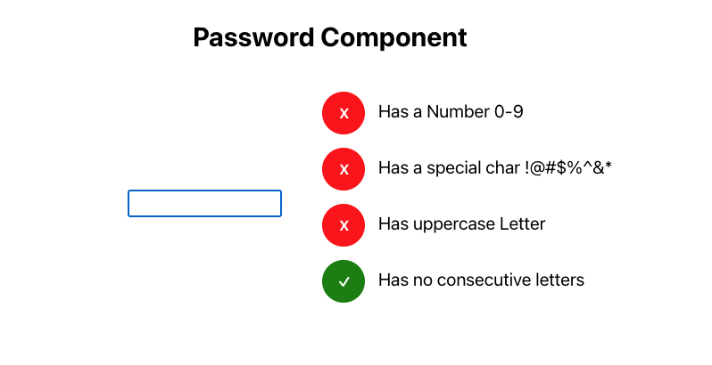

# Password Validation Component

This project was bootstrapped with [Create React App](https://github.com/facebook/create-react-app).

## How to get started

In the project directory, you can run:

### `npm install`

### `npm start`

Runs the app in the development mode.\
Open [http://localhost:3000](http://localhost:3000) to view it in the browser.

### `npm run build`

Built folder already exist, please open in browser to view.

### `npm run test`

Simple test cases for rendering components with valid props and checking the current available four password validations.

## About

Used CRA to create a demo of a password validation component because of its quick set up. Depending on the project requirements, Gatsby or Next.js can be used instead.

Includes the following password validations:
  - Contains a Number
  - Contains an UpperCase letter
  - Contains a special character !@#$%^&*
  - Does not contain consecutive letters

### Additional validations can be added via `validators.js` and used as props. All fields must be filled.

#### `validators.js`

This file contains all the validators that can be used. Each validator contains 3 fields:
  - desc : description of the validator
  - validation: function to validate and returns whether it is validated or not
  - isInUse: should default as false

## Props

| Name     |      Type     |   Description                                      |
|----------|:-------------:|:--------------------------------------------------:|
| options  |     Array     | Password Requirements from `validators.js`         |

### Existing password requirements

| Name                |      Type     |   Description                                               |
|---------------------|:-------------:|:-----------------------------------------------------------:|
| hasNumber           |     Object    | to check if password contains a number                      |
| hasUpperCase        |     Object    | to check if password contains an uppercase letter           |
| hasSpecialChar      |     Object    | to check if password contains a special character           |
| noConsecutiveLetters|     Object    | to check if password doesn't contain any consecutive letters|

### Future Development

Would like to add a second input field for password confirmation and cross check with first input